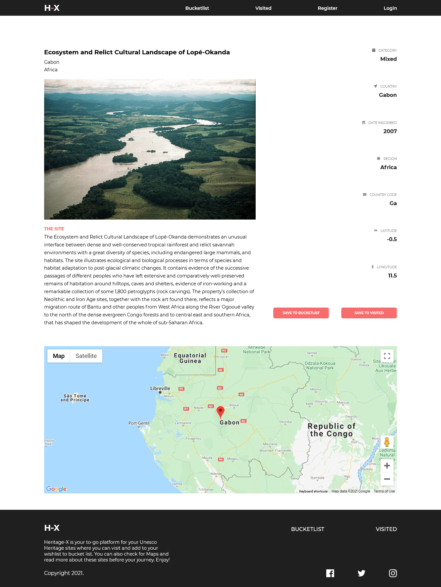

# HERITAGE

## Table of contents

- [Overview](#overview)
  - [The challenge](#the-challenge)
  - [Screenshot](#screenshot)
  - [Links](#links)
- [My process](#my-process)
  - [Built with](#built-with)
  - [What I learned](#what-i-learned)

## Overview

### The challenge

Users are be able to:

- view the optimal layout for each page depending on their device's screen size
- See hover states for all interactive elements throughout the site
- Add Items to buckelist
- Add items to Visited
- Check actual location of sites on Google Maps

### Screenshot

## My process

### Built with

- Semantic HTML5 markup
- CSS custom properties
- Flexbox
- CSS Grid
- Mobile-first workflow
- [React](https://reactjs.org/) - JS library
- SASS - For styles
- Google Maps API
- GSAP

### What I learned

Introduced to GSAP and the smooth scroll plugin.